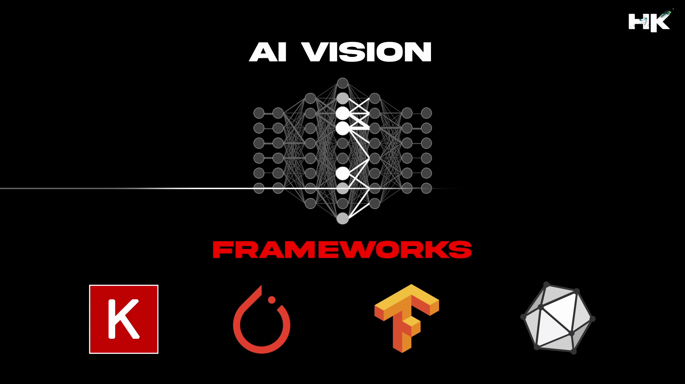

    

  

    

<h1>🔻 What is Deep Learning AI Perception</h1>

Deep Learning Perception refers a branch of artificial intelligence that mimics the human brain's ability to perceive and recognize patterns, enabling machines to make decisions based on visual inputs. It plays a crucial role in various domains such as autonomous driving, medical image analysis, and robotics etc.
  

<h1 align="left">🔻 Repository Details</h1>
<table align="center">
<thead>
<tr>
<th align="center">Naming Prefix</th>
<th align="center">Description</th>
</tr>
</thead>
<tbody>
<tr>
<td align="left"><strong>HKAI__</strong></td>
<td align="right">Perception using Deep Learning</td>
</tr>
</tbody>
</table>  

<h1>🔻 Repository Details</h1>

This repository meticulously documents my extensive journey through various projects related to cognitive perception using State-of-the-Art (SOTA) Deep Learning Models. Each project intricately tackles unique perception problems, showcasing the comprehensive application and unparalleled effectiveness of deep learning techniques in interpreting and understanding complex visual data.

<h1>🔻 State-of-the-Art (SOTA) Perception Models</h1>

<table>
<tr>
    <th>Classification</th>
    <th>Single State</th>
    <th>Double Stage</th>
    <th>Segmentation</th>
    <th>Optical Flow</th>
</tr>
<tr>
    <td>AlexNet</td>
    <td>SSD</td>
    <td>R-FCN</td>
    <td>U-Net</td>
    <td>RAFT</td>
</tr>
<tr>
    <td>VGG</td>
    <td>FCOS</td>
    <td>R-CNN</td>
    <td>SegNet</td>
    <td>FlowNet 2.0</td>
</tr>
<tr>
    <td>ResNet</td>
    <td>YOLO</td>
    <td>Fast R-CNN</td>
    <td>DeepLab</td>
    <td>FlowNet Simple</td>
</tr>
<tr>
    <td>GoogleNet</td>
    <td>RetinaNet</td>
    <td>Faster R-CNN</td>
    <td>Mask R-CNN</td>
    <td>FlowNet Correlation</td>
</tr>
</table>

 
    

    

